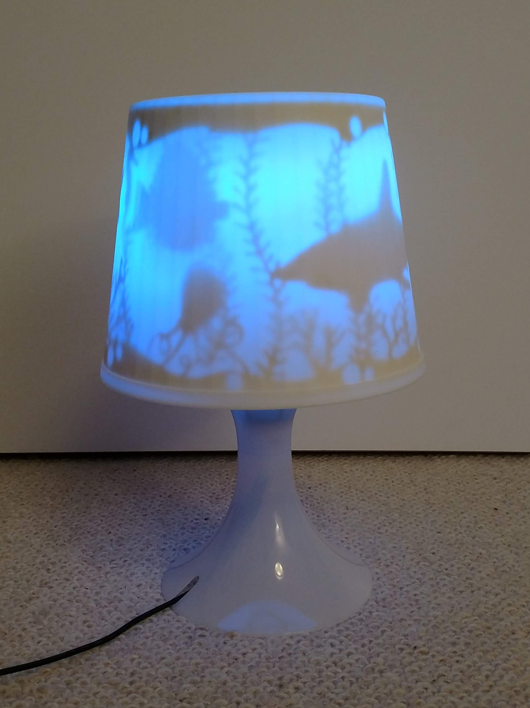
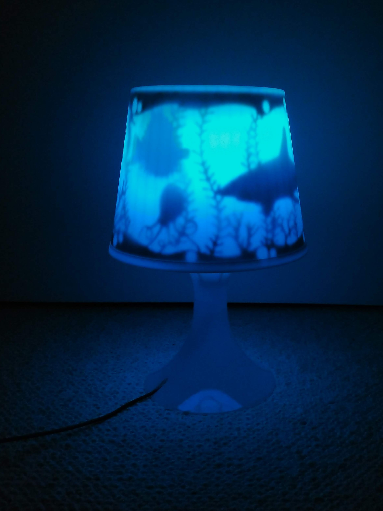
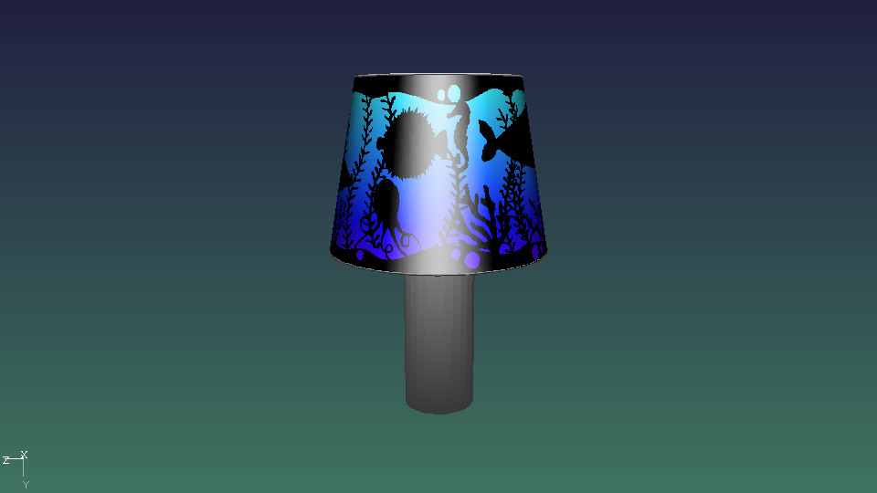

# IKEA Arduino Lampe

<p align="center">
  
  
</p>

The "lamp.mp4" is an video of the lamp in action.

The pimped lamp:
https://www.ikea.com/de/de/p/lampan-tischleuchte-weiss-20046988/

## Arduino program
To make use of "pixel_stripe_wave.ino" you need to install the Arduino IDE, open up the pixel_stripe_wave.ino-file and install the "Adafruit Neopixel" library via the library manager of the IDE.

The board I used is a clone of the "Arduino Pro Micro" which is compatible to the "Arduino Leonardo" board. Pick this as the target board from the menus, connect the Micro-USB-Port on the microcontroller board to your computer (the power lead at the bottom of the lamp does not have the data lines connected). Then use Sketch->Upload to compile the code and upload it to your board.

## G'MIC
You can get the latest version of G'MIC here:
https://gmic.eu/

The g'mic simmulation looks like this:


Use this command to simulate the lamp with G'MIC:
```bash
gmic Lampshade.png -command lamp.gmic -lamp3d
```

